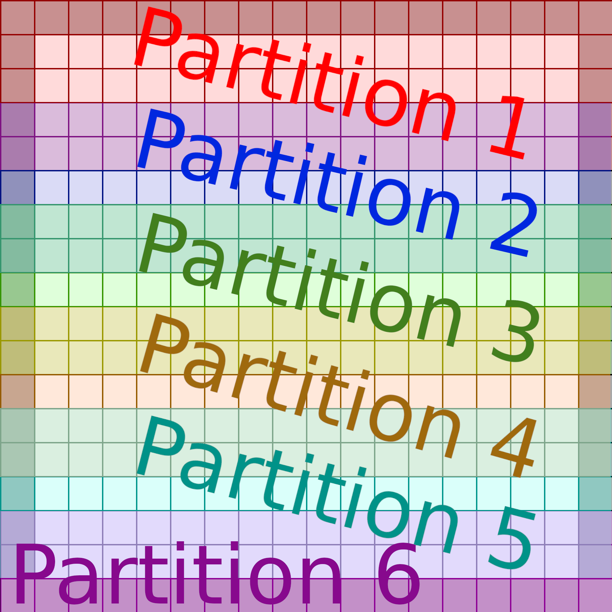
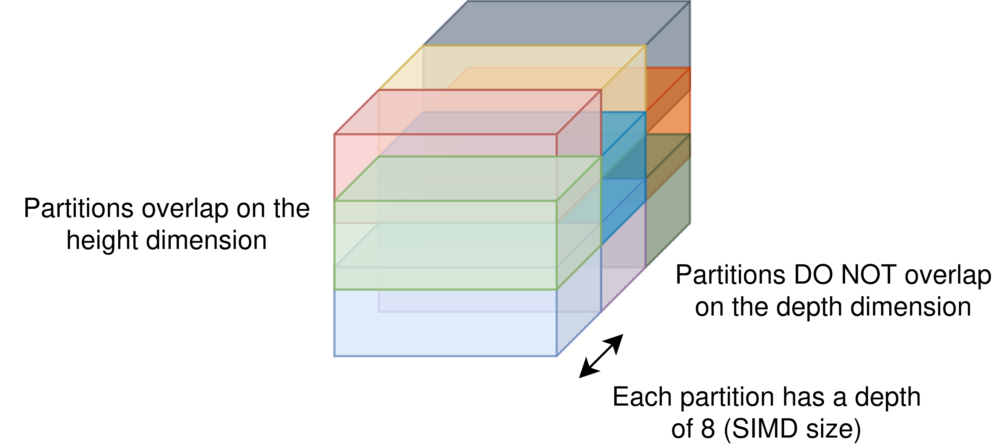

<!-- PROJECT LOGO -->
<br />
<div align="center">
  <a href="https://github.com/Wheest/rspl_examples">
    
  </a>

  <h3 align="center">RSPL examples</h3>

  <p align="center">
    A collection of examples of using the RSPL language for the N64
    <br />
  </p>
</div>


## Add One

The simplest example, which shows how we can use DMA to copy in an array of values and increment all of them by one.

## Reduction

Shows how we can do a vector reduction (i.e., the sum of a vector register).
There isn't a native instruction for this, so we need to use a trick in three instructions:

``` javascript
vec += vec.yywwYYWW;
vec += vec.zzzzZZZZ;
vec += vec.X;
```

## int16 8x8 matmul

This example does matmul (`C = A * B`) with two int16 8x8 matrices.
It assumes that overflow is not a problem.
We calculate in row-major, with the B matrix transposed to take advantage of the vector instructions.

## Depthwise conv2d (v1)

Implements channels last depthwise convolution, for int16.
The inputs are of shape `(4, 4, 8)`, the kernel size is `3x3`, the strides are 1, and the padding is 0.

## Depthwise conv2d large (v2)

This example adds support for depthwise convolutions that are too large along the height and width dimensions.
A Python Jinja script (`conv2d_rspl_gen.py`) is used to create the RSPL code for your given input size.
Unlike v1, v2 works with padding, but only stride 1, and depth 8.
It runs computations in a partitioned fashion, as you can see in this diagram which divides the input data into 6 overlapping partitions:



Partitioning is necessary because the N64 has a limited amount of memory, and partition 6 is the same size as the other 5, but with extra zeros at the end which are discarded in the final output.
The maximum height of the input and output partitions are determined by `conv2d_rspl_gen.py`, which iteratively guestimates how much memory the RSP would have left.

## Depthwise conv2d deep (v3)

This example adds support for deeper depthwise convolution, i.e., `in_c >= 8`.
It still needs to be a multiple of 8, but in my experience it usually is anyway.
It also only supports stride of 1.

It computes partitions of depth 8 in the same way as v2, but also computes other partitions of depth 8.
It computes all the outputs at a given depth first, then loads the next set of weights, and computes the next set.

An example of this is given below, where we compute the red, green, and blue partitions first, before moving back to the next set of 3 partitions.



The RSPL code generation script (`conv2d_rspl_gen.py`) has been upgraded (I'm not backporting lol), and now calls the RSPL compiler itself, rather than generating an RSPL file that you need to [copy into the web app manually](https://mbeboek.gitlab.io/rspl/).
See [the RSPL GitLab](https://gitlab.com/mbeboek/rspl) for instructions for building, and be sure to replace the path to the CLI in the code generation script.
