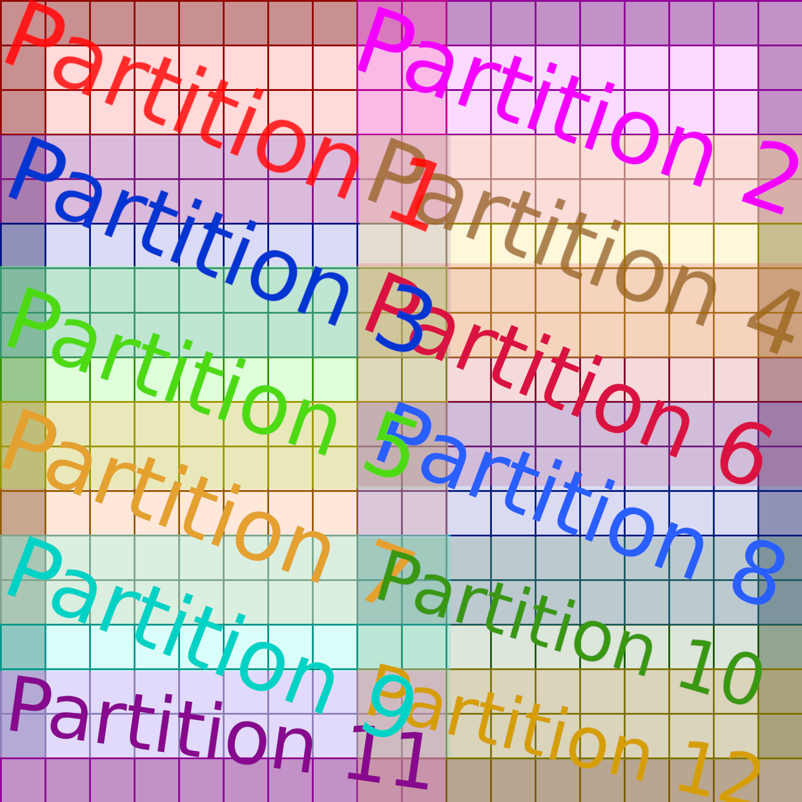

<!-- PROJECT LOGO -->
<br />
<div align="center">
  <a href="https://github.com/Wheest/rspl_examples">
    
  </a>

  <h3 align="center">RSPL examples</h3>

  <p align="center">
    A collection of examples of using the RSPL language for the N64
    <br />
  </p>
</div>

The following are some functional examples of the RSPL language for the N64's RSP co-processor.
A web app with docs and transpiler for RSPL is [available here](https://mbeboek.gitlab.io/rspl/), which explains more about it.
Big props to Max Bebök (HailToDodongo) for all their work on it.
The language is great, because the alternative for writing accelerated RSP code on the N64 is raw MIPS assembly, which is time consuming to write.

I made this repository because there were not a lot of small self-contained examples for the RSPL language, and I was developing accelerated kernels for my [DNN64 project](https://gibsonic.org/blog/2024/03/12/dnn64_p1).

## Add One

The simplest example, which shows how we can use DMA to copy in an array of values and increment all of them by one.

## Reduction

Shows how we can do a vector reduction (i.e., the sum of a vector register).
There isn't a native instruction for this, so we need to use a trick in three instructions:

``` javascript
vec += vec.yywwYYWW;
vec += vec.zzzzZZZZ;
vec += vec.X;
```

Check out [my Twitter thread](https://twitter.com/PerryGibson_/status/1776239662136185044) if you want to understand why this works.

## Many args

The RSP has 4 argument registers (`$a0`-`$a3`), which can be passed to commands:

``` javascript
command<0> Example(u32 a, u32 b, u32 c, u32 d)
```

a is implictily given the `$a0` register, and so on.
If you require more arguments, you need to set them explicitly, e.g.:

``` javascript
command<0> SetArgs(u32 a, u32 b, u32 c, u32 d, u32<$s0> e)
```

Where we store the `e` variable in the `$s0` register.

If you are calling a function many times, and have lots of arguments which remain constant between invocations (but cannot be hard-coded ), you may want to store the arguments in the state.

This example shows this behaviour.

## int32 accumulation

When we do lots of multiplications (and accumulations), there's a risk that we can overflow (e.g., multiply two 16 bit values, and you could require 32 bits).
On the RSP, we can handle this, which is what this example shows.

However, a word of warning.
This elementwise multiplication of two int16 vector registers (with 8 values in each) stores the result in two vector registers, since we need 256 bits for 8 32-bit values.
But the format is not what we need, it stores the upper 2 bytes of each element first, and then the lower 2 bytes.

This means that to get our values, we need move the bytes around.
I chose to do this on the CPU-side (using the `reconstruct_vector` function), as it makes more sense for my usecase.
However, there are ways of doing it on the RSP-side.  Check out the [N64brew Discord](https://n64brew.dev/wiki/Main_Page) for more information.

## int8 expansion

The RSP works with lane sizes of 16-bits, but there may be cases where your data is int8.
We can take advantage of the reduced data size with fewer DMA transfers, and then use the RSP to cast the data to int16.
Note that loading int8 to int16 puts the data on the upper byte, so we need to have an extra instruction to right shift to the lower ones.

## int16 8x8 matmul

This example does matmul (`C = A * B`) with two int16 8x8 matrices.
It assumes that overflow is not a problem (otherwise you would need to add int32 accumulation like the above example).
We calculate in row-major, with the B matrix transposed to take advantage of the vector instructions.

## Dynamic scratchpad

Although it can be useful to have explicit buffers for data (as seen in the matmul example with `MAT_L`, `MAT_R`, and `MAT_RES`), there may be situations where the size of your data is more dynamic (e.g., you have variable sizes of matrices).
In this case, it might make sense to declare a unified data buffer, and then keep track of pointers to the start of each buffer within that buffer.
This example shows this behaviour.

Note that our extra argument is in `$s1` instead of `$s0` (which is what the extra arg example uses) because that register is used by DMA.

## Dump DMEM

In debugging, it is occasionally useful to dump the DMEM (the memory of RSP), and inspect the hex.
This has helped me in a couple of situations (e.g., identifying the my data is not properly aligned).
This example shows the behaviour, using the `rsp_read_data` function, and `debug_hexdump`.
It shows how the RSP code inserts the string "AWRIGHT?" into memory:

```
0000  00 41 00 57 00 52 00 49  00 47 00 48 00 54 00 3f   |.A.W.R.I.G.H.T.?|
0010  80 00 40 00 20 00 10 00  08 00 04 00 02 00 01 00   |..@. ...........|
0020  00 10 00 00 00 00 00 00  00 00 00 00 00 00 00 00   |................|
```

Libdragon shows each bytes as an ASCII character on the right, which can also be handy for marking areas of memory.
Note for reading the hex dump, the `*` character is used to denote that lines of memory are identical.

## Unusual accumulation

This example highlights a potential source of bugs which comes from how MACs (multiply-accumulate operations) work on the RSP.

In this example, we have 4 values, `w0`, `x0`, `w`, and `x`.  We want to compute `(w0 * x0) + (w * x)`, onto a `vec32` register.

The values are packed 8-bit integers, so we need to unpack them the `load_vec_s8` method and right-shift them.

You might have some RSPL code which looks something like:

``` javascript
vec16 w0 = load_vec_s8(DATA_W, 0x00);
w0 >>= 8;
vec16 x0 = load_vec_s8(DATA_X, 0x00);
x0 >>= 8;
vec32 y = w0 * x0;

vec16 w = load_vec_s8(DATA_W, 0x08);
w >>= 8;
vec16 x = load_vec_s8(DATA_X, 0x08);
x >>= 8;

y = w +* x;
```

However, this gives an incorrect result, because it introduces a subtle bug.
The problem is the special accumulator register used in the RSP.
Normally, our vector registers are 128-bit, with 8 16-bit lanes.
We can also compute 32-bit values using 2 registers.

However, for certain operations we may require more bits, which is why the N64's RSP has a 48 bit-per-lane special register meant to hold intermediate calculations without overflowing.
However, there is only one of these registers, and the bug that we're seeing here is that the right-shift operator `>>` is touching this register.

Therefore, to fix this we need to reorder our computation so that our MAC is not interrupted by the right shift:

``` javascript
vec16 w0 = load_vec_s8(DATA_W, 0x00);
w0 >>= 8;
vec16 x0 = load_vec_s8(DATA_X, 0x00);
x0 >>= 8;

vec16 w = load_vec_s8(DATA_W, 0x08);
w >>= 8;
vec16 x = load_vec_s8(DATA_X, 0x08);
x >>= 8;

vec32 y = w0 * x0;
y = w +* x;
```

## Depthwise convolution

The following are examples of running the [depthwise convolution operation](https://paperswithcode.com/method/depthwise-convolution), at increasing levels of complexity.
E.g., the first version assumes a fixed data size, that can fit on the RSP completely; whereas v2 allows larger datasizes, but fixed strides, etc.

### Depthwise conv2d (v1)

Implements channels last depthwise convolution, for int16, accumulating onto int16 (so assumes no overflow).
The inputs are of shape `(4, 4, 8)`, the kernel size is `3x3`, the strides are 1, and the padding is 0.

### Depthwise conv2d large (v2)

This example adds support for depthwise convolutions that are too large along the height and width dimensions.
A Python Jinja script (`conv2d_rspl_gen.py`) is used to create the RSPL code for your given input size.
Unlike v1, v2 works with padding, but only stride 1, and depth 8.
It runs computations in a partitioned fashion, as you can see in this diagram which divides the input data into 6 overlapping partitions:


Partitioning is necessary because the N64 has a limited amount of memory, and partition 6 is the same size as the other 5, but with extra zeros at the end which are discarded in the final output.
The maximum height of the input and output partitions are determined by `conv2d_rspl_gen.py`, which iteratively guestimates how much memory the RSP would have left.

The script (`conv2d_rspl_gen.py`) prints what the suggested partition sizes are, and you should edit them in the `main.c` file as appropriate.
You need to manually copy the generated RSPL file to the [RSPL webapp](https://mbeboek.gitlab.io/rspl/), then copy the generated assembly into the `rsp_simple.S` file.
It is not until version 3 of the script (adding support for deeper depthwise convolutions) that I add automatic compilation.

### Depthwise conv2d deep (v3)

This example adds support for deeper depthwise convolution, i.e., `in_c >= 8`.
It still needs to be a multiple of 8, but in my experience it usually is anyway.
It also only supports stride of 1.

It computes partitions of depth 8 in the same way as v2, but also computes other partitions of depth 8.
It computes all the outputs at a given depth first, then loads the next set of weights, and computes the next set.

An example of this is given below, where we compute the red, green, and blue partitions first, before moving back to the next set of 3 partitions.


The RSPL code generation script (`conv2d_rspl_gen.py`) has been upgraded (I'm not backporting lol), and now calls the RSPL compiler itself, rather than generating an RSPL file that you need to [copy into the web app manually](https://mbeboek.gitlab.io/rspl/).
See [the RSPL GitLab](https://gitlab.com/mbeboek/rspl) for instructions for building, and be sure to replace the path to the CLI in the code generation script.

### Depthwise conv2d stride (v4)

This example extends v3 to support strides for depthwise convolution.
When using a stride greater than 1, the average speedups go from ~8.4x to ~4.4x, since there is now less data reuse.

The RSPL code generation script (`conv2d_rspl_gen.py`) has been upgraded, and now also better calculates the state memory available and being used by our kernel, so that it suggests larger partition sizes.

### Depthwise conv2d general (v5)

This example extends v4 to work with generic data sizes.
Whereas previously the code needed to be generated using a Jinja template for a specific data size, now the RSPL code takes arguments, and only needs to be compiled once for all supported data sizes.

Instead, the ucode takes arguments at execution time.
Since we call out `DepthConv` function many times for each layer (see above for details about the partitions), we don't want to waste memory bandwidth sending the same arguments over and over.
Therefore we add a `SetArgs` function which is called once and stores the constants in the state.

Similarly, since the sizes of the data and outputs could change, we create a unified `DATA` buffer and store the pointers to the start of each subarray.

### Depthwise conv2d quant (v6)

This version adds support for quantisation, where our inputs and weights are `int8`, and our outputs are `int32`.
It uses techniques seen in the "int32 accumulation" and "int8 expansion" example, as well as the "Unusual accumulation" example.


### Depthwise conv2d wide (v7)

This adds support for when the input data is too wide to fit a full partition.
In this case, we split the data into both horizontal and vertical tiles.
You can see an example of what this looks like:



In addition, this version adds a unit testing suite, and support for asymmetric padding.
